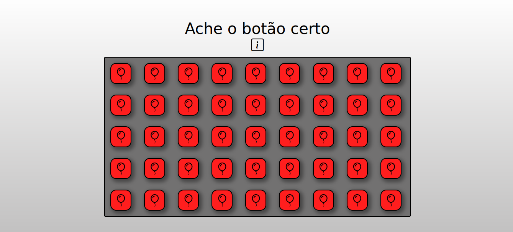

# JOGO SIMPLES HTML/CSS/JS
### Jogo de ache o certo

#### Pré visu:


## HTML:
```
    <!DOCTYPE html>
<html lang="pt-BR">
<head>
    <meta charset="UTF-8">
    <meta name="viewport" content="width=device-width, initial-scale=1.0">
    <title>Ache o botão certo</title>
    <link rel="stylesheet" href="css/style.css">
    <link rel="stylesheet" href="https://cdn.jsdelivr.net/npm/bootstrap-icons@1.10.5/font/bootstrap-icons.css">
</head>
<body>

    <audio src="audi/Errou - Faustao Falando.mp3" id="erro"></audio>
    <audio src="audi/Faustão Acertou meme.mp3" id="acertou"></audio>

    <div class="h1">
        <h1>Ache o botão certo</h1>
        <i class="bi bi-info-square" id="i" onmouseover="Mc()"></i><!--i-->
    </div><!--h1-->

    <div class="background">
        <div class="bot" onclick="Er()" id="bot1">
            <i class="bi bi-balloon"></i>
        </div><!--bot-->
        <div class="bot" onclick="Er()" id="bot1">
            <i class="bi bi-balloon"></i>
        </div><!--bot-->
        <div class="bot" onclick="Er()" id="bot1">
            <i class="bi bi-balloon"></i>
        </div><!--bot-->
        <div class="bot" onclick="Er()" id="bot1">
            <i class="bi bi-balloon"></i>
        </div><!--bot-->
        <div class="bot" onclick="Er()" id="bot1">
            <i class="bi bi-balloon"></i>
        </div><!--bot-->
        <div class="bot" onclick="Er()" id="bot1">
            <i class="bi bi-balloon"></i>
        </div><!--bot-->
        <div class="bot" onclick="Er()" id="bot1">
            <i class="bi bi-balloon"></i>
        </div><!--bot-->
        <div class="bot" onclick="Er()" id="bot1">
            <i class="bi bi-balloon"></i>
        </div><!--bot-->
        <div class="bot" onclick="Er()" id="bot1">
            <i class="bi bi-balloon"></i>
        </div><!--bot-->
        <div class="bot" onclick="Er()" id="bot1">
            <i class="bi bi-balloon"></i>
        </div><!--bot-->
        <div class="bot" onclick="Er()" id="bot1">
            <i class="bi bi-balloon"></i>
        </div><!--bot-->
        <div class="bot" onclick="Er()" id="bot1">
            <i class="bi bi-balloon"></i>
        </div><!--bot-->
        <div class="bot" onclick="Er()" id="bot1">
            <i class="bi bi-balloon"></i>
        </div><!--bot-->
        <div class="bot" onclick="Er()" id="bot1">
            <i class="bi bi-balloon"></i>
        </div><!--bot-->
        <div class="bot" onclick="Er()" id="bot1">
            <i class="bi bi-balloon"></i>
        </div><!--bot-->
        <div class="bot" onclick="Er()" id="bot1">
            <i class="bi bi-balloon"></i>
        </div><!--bot-->
        <div class="bot" onclick="Er()" id="bot1">
            <i class="bi bi-balloon"></i>
        </div><!--bot-->
        <div class="bot" onclick="Er()" id="bot1">
            <i class="bi bi-balloon"></i>
        </div><!--bot-->
        <div class="bot" onclick="Er()" id="bot1">
            <i class="bi bi-balloon"></i>
        </div><!--bot-->
        <div class="bot" onclick="Er()" id="bot1">
            <i class="bi bi-balloon"></i>
        </div><!--bot-->
        <div class="bot" onclick="Er()" id="bot1">
            <i class="bi bi-balloon"></i>
        </div><!--bot-->
        <div class="bot" onclick="Er()" id="bot1">
            <i class="bi bi-balloon"></i>
        </div><!--bot-->
        <div class="bot" onclick="Er()" id="bot1">
            <i class="bi bi-balloon"></i>
        </div><!--bot-->
        <div class="bot" id="botoff" onclick="Ac()" id="bot1"><!--off-->
            <i class="bi bi-balloon"></i>
        </div><!--bot-->
        <div class="bot" onclick="Er()" id="bot1">
            <i class="bi bi-balloon"></i>
        </div><!--bot-->
        <div class="bot" onclick="Er()" id="bot1">
            <i class="bi bi-balloon"></i>
        </div><!--bot-->
        <div class="bot" onclick="Er()" id="bot1">
            <i class="bi bi-balloon"></i>
        </div><!--bot-->
        <div class="bot" onclick="Er()" id="bot1">
            <i class="bi bi-balloon"></i>
        </div><!--bot-->
        <div class="bot" onclick="Er()" id="bot1">
            <i class="bi bi-balloon"></i>
        </div><!--bot-->
        <div class="bot" onclick="Er()" id="bot1">
            <i class="bi bi-balloon"></i>
        </div><!--bot-->
        <div class="bot" onclick="Er()" id="bot1">
            <i class="bi bi-balloon"></i>
        </div><!--bot-->
        <div class="bot" onclick="Er()" id="bot1">
            <i class="bi bi-balloon"></i>
        </div><!--bot-->
        <div class="bot" onclick="Er()" id="bot1">
            <i class="bi bi-balloon"></i>
        </div><!--bot-->
        <div class="bot" onclick="Er()" id="bot1">
            <i class="bi bi-balloon"></i>
        </div><!--bot-->
        <div class="bot" onclick="Er()" id="bot1">
            <i class="bi bi-balloon"></i>
        </div><!--bot-->
        <div class="bot" onclick="Er()" id="bot1">
            <i class="bi bi-balloon"></i>
        </div><!--bot-->
        <div class="bot" onclick="Er()" id="bot1">
            <i class="bi bi-balloon"></i>
        </div><!--bot-->
        <div class="bot" onclick="Er()" id="bot1">
            <i class="bi bi-balloon"></i>
        </div><!--bot-->
        <div class="bot" onclick="Er()" id="bot1">
            <i class="bi bi-balloon"></i>
        </div><!--bot-->
        <div class="bot" onclick="Er()" id="bot1">
            <i class="bi bi-balloon"></i>
        </div><!--bot-->
        <div class="bot" onclick="Er()" id="bot1">
            <i class="bi bi-balloon"></i>
        </div><!--bot-->
        <div class="bot" onclick="Er()" id="bot1">
            <i class="bi bi-balloon"></i>
        </div><!--bot-->
        <div class="bot" onclick="Er()" id="bot1">
            <i class="bi bi-balloon"></i>
        </div><!--bot-->
        <div class="bot" onclick="Er()" id="bot1">
            <i class="bi bi-balloon"></i>
        </div><!--bot-->
        <div class="bot" onclick="Er()" id="bot1">
            <i class="bi bi-balloon"></i>
        </div><!--bot-->
    </div><!--background-->
    <script src="js/script.js"></script>
</body>
</html>
```

## CSS:

```
    *{
    padding: 0;
    margin: 0;
    box-sizing: border-box;
    font-weight: normal;
    font-family: Verdana, Geneva, Tahoma, sans-serif;
    user-select: none;
}
html,body{
    height: 100%;
    background: linear-gradient(#FFFFFF,#c0bfbf);
    display: flex;
    align-items: center;
    justify-content: center;
    flex-direction: column;
}

/*titulo*/
.h1{
    text-align: center;
}
.h1 h1{
    margin-top: 5px;
    font-size: 40px;
}
.h1 i{
    font-size: 33px;
    cursor: pointer;
}
.background{
    width: 800px;
    height: auto;
    border: 2px solid #000000;
    background-color: #727171;
    margin: 0 auto;
    margin-top: 10px;
    border-radius: 3px;
}
.background > .bot{
    background-color: #ff1e1e;
    display: inline-block;
    padding: 8px;
    font-size: 33px;
    margin: 14px;
    flex-wrap: wrap;
    border-radius: 15px;
    width: 55px;
    height: 55px;
    text-align: center;
    border: 2px solid #000000;
    box-shadow: 5px 5px 9px 3px #00000064;
    cursor: pointer;
    transition: 0.3s;
}
.background > .bot:hover{
    background-color: #ff0000;
    border-radius: 8px;
    box-shadow: 5px 5px 33px 3px #00000064;
    color: #FFFFFF;
}
.background > .bot:active{
    background-color: #c0bfbf;
    color: #000000;
}
```

## JS:
```
    'use strict'

//audios
const acertou = document.getElementById('acertou')
const errou = document.getElementById('erro')
  const botoff = document.getElementById('botoff')
function Ac(){
  acertou.play()
  botoff.style.backgroundColor = 'green'
}
function Er(){
  errou.play()
}
function Mc(){
  window.alert('Acertou ou errou assim que joga')
}
```